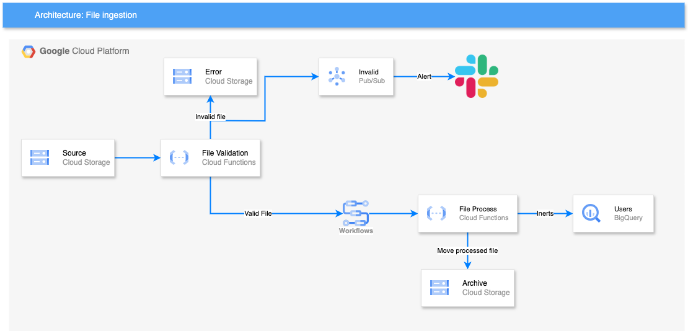

# Automated CSV Data Ingestion from GCS to BigQuery

This repository contains the infrastructure and code to build an automated data pipeline that processes CSV files uploaded to Google Cloud Storage (GCS) and loads them into BigQuery.

**Key Features:**

* **Automated Ingestion:** Triggers data processing when new CSV files are uploaded to GCS.
* **Data Validation:** Validates CSV file format and schema using Cloud Functions.
* **Orchestration:** Manages the pipeline workflow using Google Cloud Workflows.
* **Data Transformation:** Performs basic data cleansing, deduplication.
* **BigQuery Loading:** Loads transformed data into BigQuery for analysis.
* **Infrastructure as Code:** Provisions all necessary resources using Terraform.
* **Archiving:** Moves processed files to an archive GCS bucket.

**Technologies Used:**

* Google Cloud Storage (GCS)
* Google Cloud Functions (Gen 2)
* Google Cloud Pub/Sub
* Google Cloud Workflows
* Google BigQuery
* Google Cloud Alerting
* Terraform
* Python

Architecture Diagram 